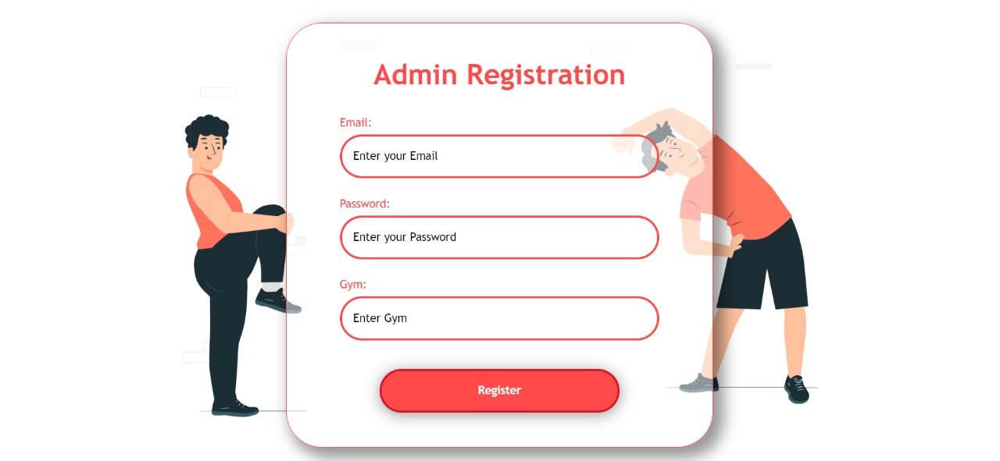
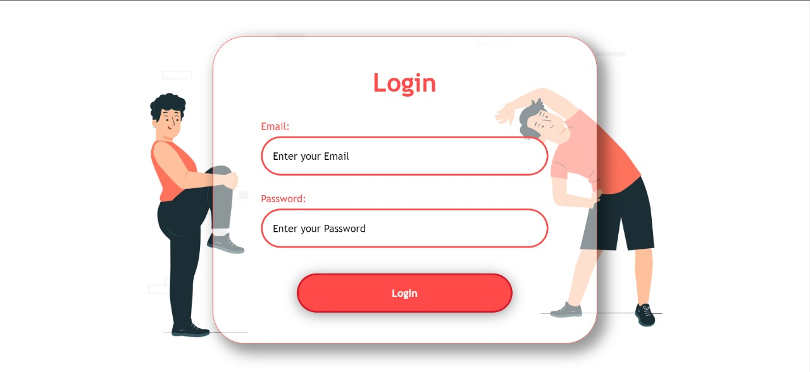
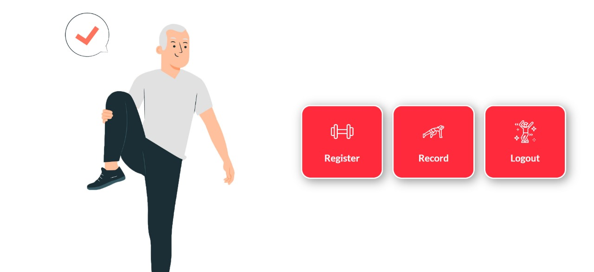
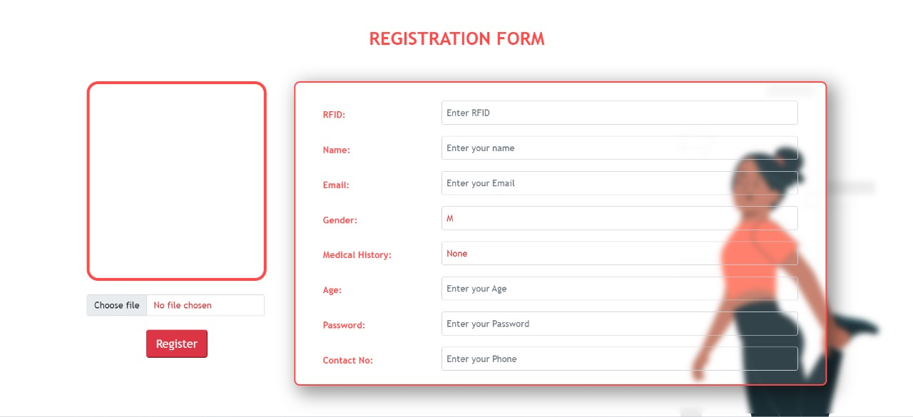
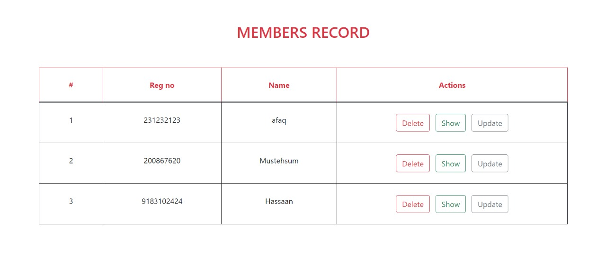
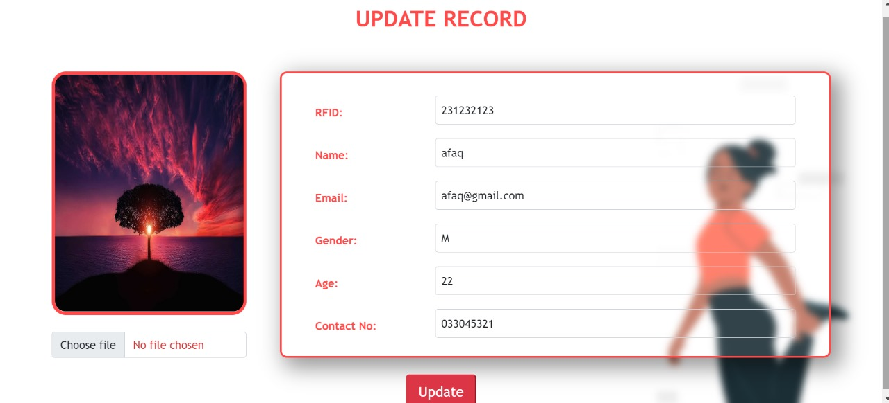
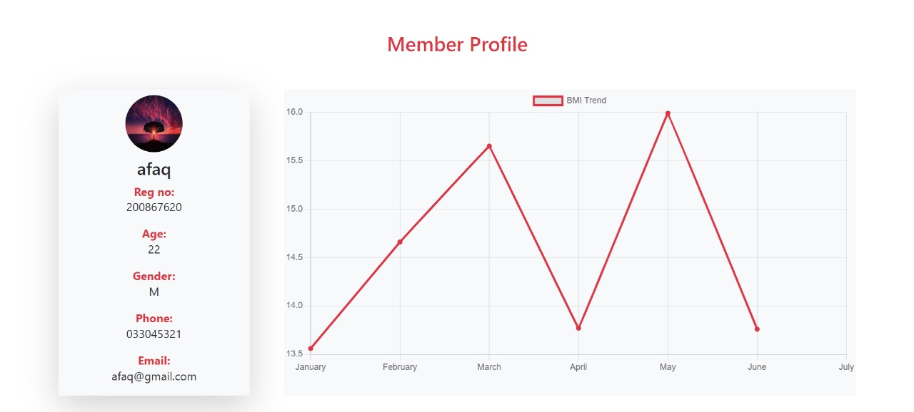

# Project Name

## Introduction

Welcome to the FitScanPro App repository! This project showcases our Final Year Project website, a modern, responsive website design featuring several key pages. Each page is meticulously crafted to provide an engaging user experience. This README will guide you through the project structure, the technologies used, and provide screenshots of the design.

## Technologies

This project leverages the following technologies:

- **HTML5**: For the structure of the pages.
- **CSS3**: For styling and layout.
- **JavaScript**: For interactive elements and functionality.
- **Bootstrap**: For responsive design and grid layout.
- **Firebase**: For database


## Screenshots










## Installation

To get a local copy up and running, follow these simple steps:

1. Clone the repository
    ```sh
    https://github.com/mhassaannaveed/Fyp.git
    ```
2. Open the index.html file in your browser to view the website locally.


Project Link: [here](https://github.com/mhassaannaveed/Fyp)
